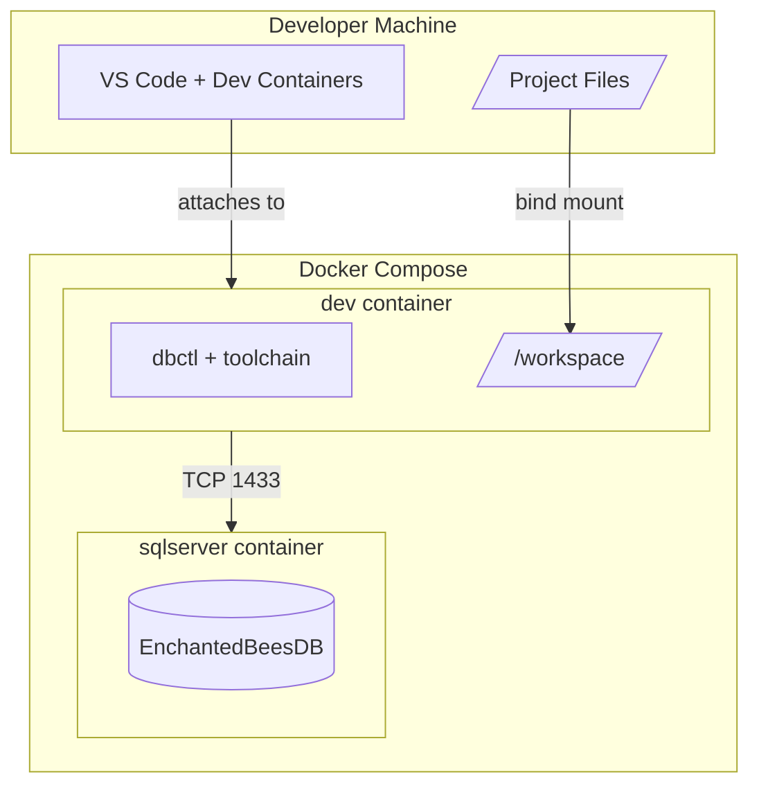
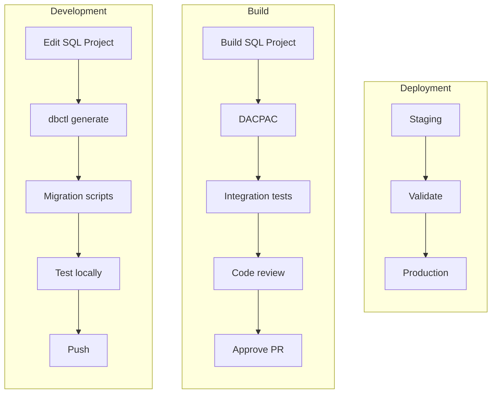
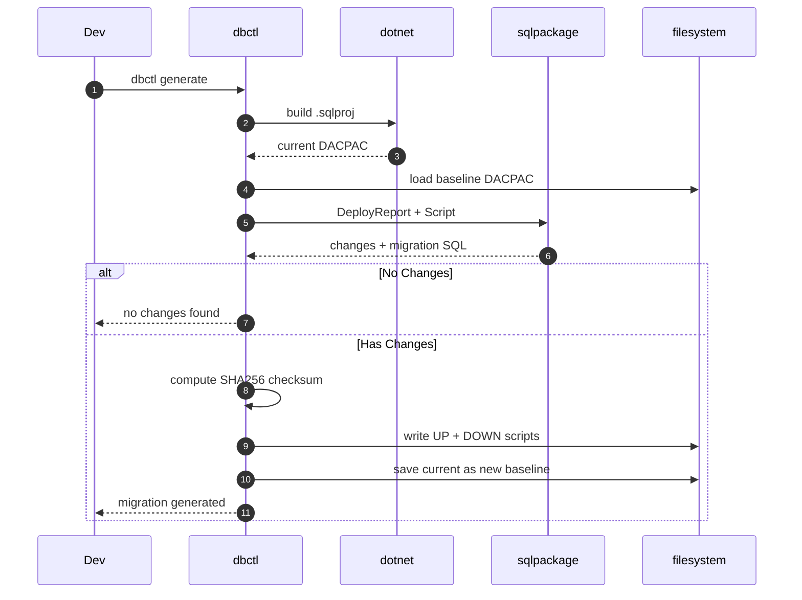
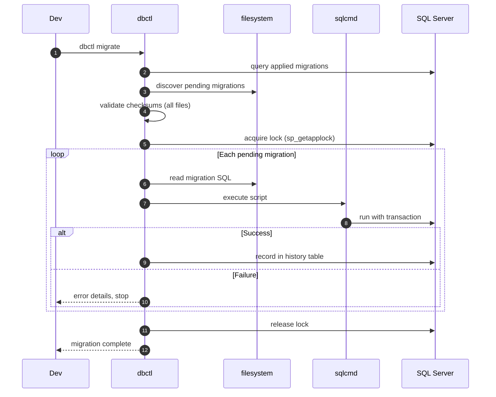

# Project Overview

A modern approach to SQL Server database development that prioritizes both **developer velocity** and **production safety**.

## The Vision

Traditional SQL Server development often forces a choice: either fast local iteration with manual deployments, or rigorous change management that slows development. This project demonstrates you can have both.

**Core Principles:**
- **Schema as Code** — The SQL project is the source of truth, not the database
- **Automated Change Detection** — No manual migration authoring; changes are derived from schema diffs
- **Cryptographic Integrity** — Every migration carries a SHA256 checksum for tamper detection
- **Cross-Platform Development** — Native performance on ARM64 (Mac) and AMD64 (Windows/Intel)
- **Production Parity** — Local development uses real SQL Server engines, not mocks

---

## Development Environment

The entire development environment is containerized — not just for consistency, but to encode the complete change lifecycle into a reproducible system. A new team member can clone the repository, run `docker compose up`, and immediately have access to:

- A fully configured toolchain (build, diff, migrate)
- A running SQL Server instance with the current schema
- The same workflow used in CI/CD and production deployments

This eliminates environment drift and ensures that the patterns developers use locally are identical to what runs in the pipeline. The container becomes living documentation of the system's operational requirements.



### Cross-Platform Support

| Architecture | Database Engine | Use Case |
|--------------|-----------------|----------|
| ARM64 (Mac) | Azure SQL Edge | Fast local development |
| AMD64 (Windows/Intel) | SQL Server 2022 | CI/CD and production parity |

Both engines use SQL Server 2019 compatibility level, ensuring schema and migrations work identically across platforms.

---

## Artifact Deployment Pipeline

A change flows through three stages: local development, CI/CD build validation, and environment deployment.



### Key Artifacts

| Artifact | Purpose | Location |
|----------|---------|----------|
| SQL Project | Source of truth for schema | `EnchantedBeesDB/` |
| DACPAC | Compiled, portable schema | `EnchantedBeesDB/bin/Debug/` |
| Baseline DACPAC | Previous schema snapshot | `.dbctl/baselines/` |
| Migration Scripts | Executable change scripts | `migrations/` |

---

## Migration Generation Sequence

When a developer modifies the schema, the `dbctl generate` command detects changes and produces migration scripts automatically.



---

## Migration Execution Sequence

The `dbctl migrate` command applies pending migrations with full integrity verification and audit logging.



### Safety Features

| Feature | Purpose |
|---------|---------|
| **Application Lock** | Prevents concurrent migration execution across instances |
| **SHA256 Checksums** | Detects if migration files were modified after application |
| **Transaction Wrapping** | Each migration is atomic; failures roll back cleanly |
| **Execution Tracking** | Full audit trail with timestamps and duration |
| **Dry-Run Mode** | Preview migrations without applying (`--dry-run`) |

---

## Project Structure

```
project/
├── databases/                # Database Projects
|   └── CustomerDB/           # SQL Database Project (source of truth)
│      ├── Tables/            # Table definitions
│      └── CustomerDB.sqlproj
|   └── ProductDB/            # SQL Database Project (source of truth)
│      ├── Tables/            # Table definitions
│      └── ProductDB.sqlproj
├── migrations/               # Generated migration scripts
|   └── CustomerDB/
|   └── ProductDB/
├── .dbctl/
│   └── baselines/            # DACPAC snapshots for diff comparison
├── src/dbctl/                # CLI tool source
└── docs/                     # Documentation
```

---

## Quick Reference

```bash
# Start environment
docker compose up -d

# Initialize database
docker compose exec dev dbctl init

# Development cycle
# 1. Edit SQL project files
# 2. Generate migration
docker compose exec dev dbctl generate

# 3. Review generated migration
# 4. Apply migration
docker compose exec dev dbctl migrate

# Check status
docker compose exec dev dbctl status
```

---

## Further Reading

- [Architecture Decisions](ARCHITECTURE.md) — Cross-platform design and implementation details
- [Getting Started](GETTING_STARTED.md) — Detailed setup instructions
- [Testing Guide](TESTING.md) — Test suite and quality assurance
